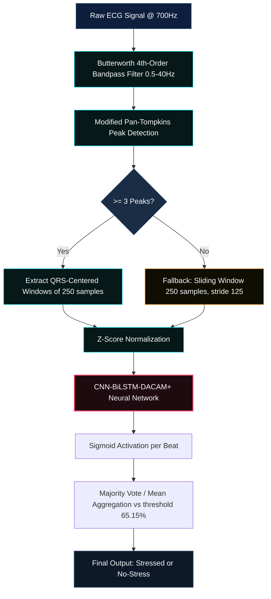
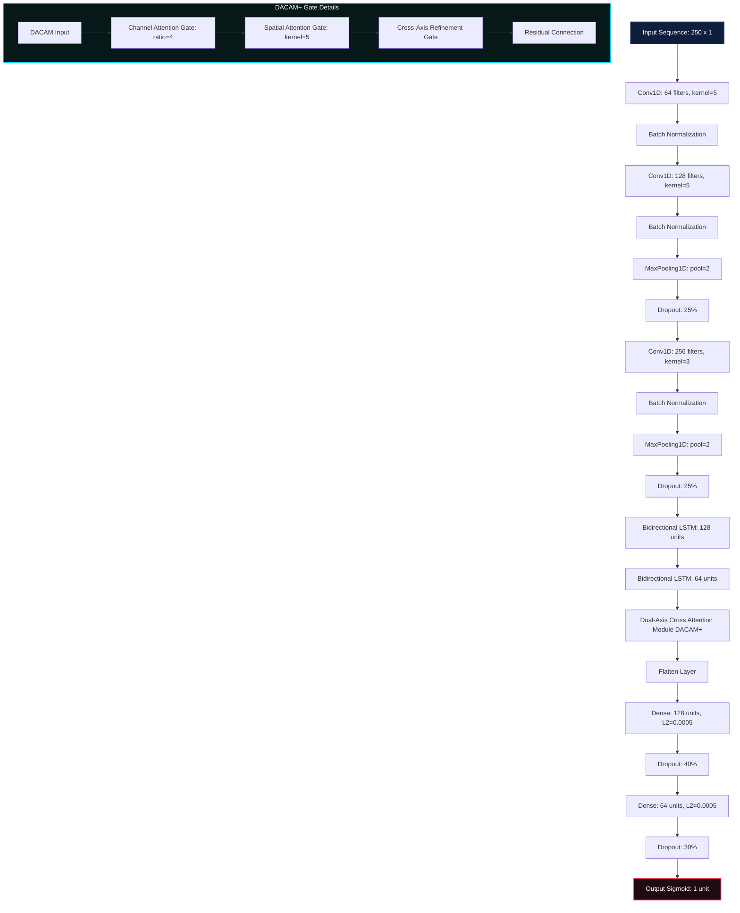
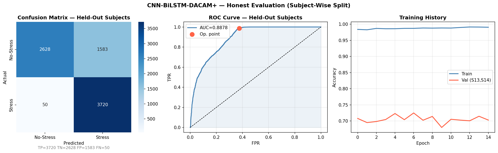
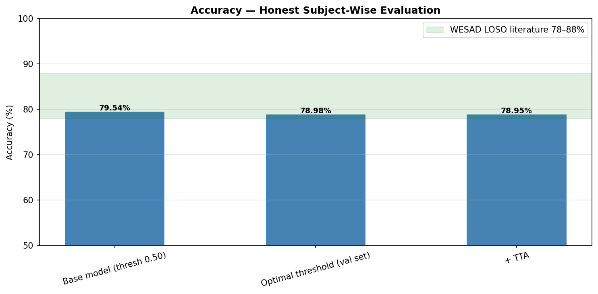
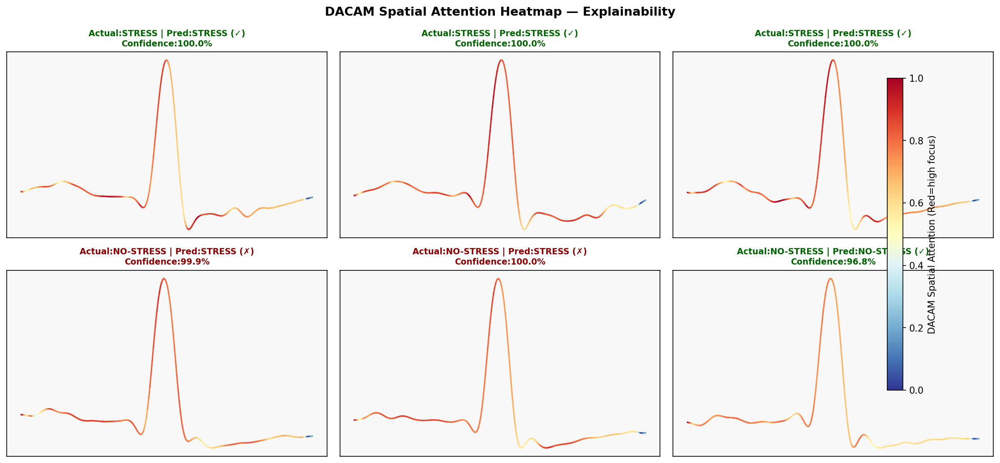
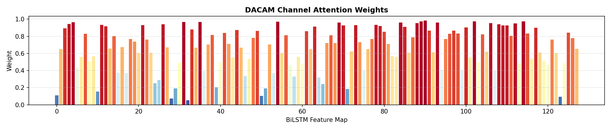
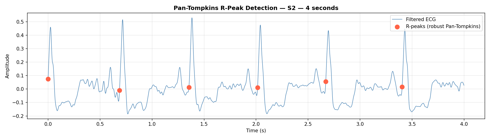
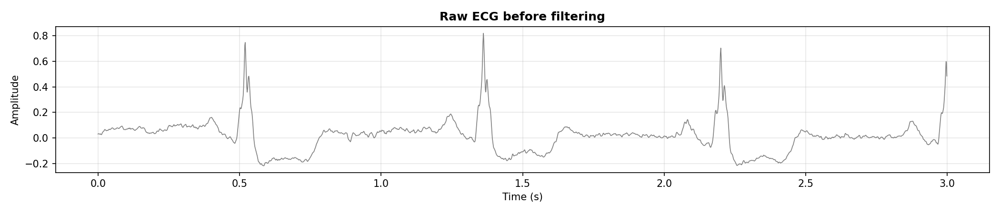
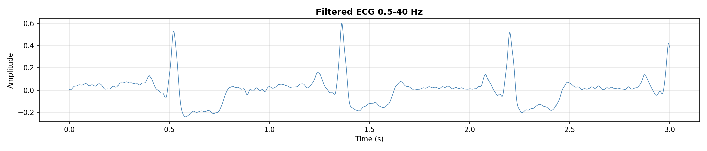

# 🫀 ECG Stress Predictor — CNN-BiLSTM-DACAM+

[](https://stress--prediction-model.streamlit.app/)

An advanced, end-to-end, deep learning pipeline for real-time stress detection using raw Electrocardiogram (ECG) signals. Leveraging a hybrid neural network architecture comprising **1D Convolutional Neural Networks (CNN)**, **Bidirectional Long Short-Term Memory (BiLSTM)** networks, and the state-of-the-art **Dual-Axis Cross Attention Module (DACAM+)**, this system predicts stress states from human ECG sequences.

The model is pre-trained on the **MIT-BIH Arrhythmia Database** for robust ECG feature extraction, fine-tuned on the physiological **WESAD (Wearable Stress and Affect Detection)** dataset, and optimized to run with high efficiency on modern Intel CPUs using **oneDNN** hardware acceleration. A real-time, interactive **Streamlit dashboard** enables users to upload or simulate ECG signals, run predictions, and visualize attention explainability heatmaps.

---

## 📊 Visual Infographics

### 1. Data Preprocessing & Signal Processing Pipeline
The following flowchart illustrates the step-by-step processing of a raw ECG signal before it is passed to the neural network for inference:



### 2. CNN-BiLSTM-DACAM+ Neural Network Model Layout
This block diagram outlines the layers of the custom deep learning model, highlighting the **Dual-Axis Cross Attention Module (DACAM+)**:



---

## 🛠️ Core Preprocessing & Signal Processing

The signal processing stage is designed to ensure maximum signal-to-noise ratio (SNR) and isolate raw ECG components relevant to stress-related heart rate fluctuations:

1. **Butterworth Bandpass Filter**: Uses a 4th-order filter between `0.5 Hz` and `40.0 Hz` to eliminate:
   - Low-frequency baseline wander caused by breathing movement.
   - High-frequency muscle tremors (EMG artifacts) and $50\text{/}60\text{ Hz}$ power line hum.
2. **Robust Pan-Tompkins Peak Detection**: Detects ECG R-peaks. Features an optimization that clips the moving window integration (MWI) signal at the $99.5\text{th}$ percentile prior to calculating the adaptive peak threshold. This prevents single transient high-amplitude artifacts (such as major movement) from blinding the peak detector.
3. **QRS-Centered Segmentation**: Segments ECG signals into windows of 250 samples (~$357\text{ ms}$ at $700\text{ Hz}$) centered around each detected R-peak. 
4. **Z-Score Normalization**: Each window is normalized individually:
   $$\mathbf{x}_{norm} = \frac{\mathbf{x} - \mu}{\sigma + 10^{-8}}$$
   This normalizes the amplitude and keeps features scale-invariant.
5. **Sliding Window Fallback**: If the signal contains fewer than 3 peaks (low quality, noisy, or short duration), it falls back to a sliding window of length 250 with a stride of 125 to ensure the network can still run inference.

---

## 🧠 Neural Network Model (CNN-BiLSTM-DACAM+)

The model is built to balance structural spatial analysis, long-term sequence learning, and feature map weighting:

* **3-Block Convolutional Feature Extractor**:
  - Dilation rates and pooling capture localized shapes (QRS complexes, P-waves, T-waves) that vary under physiological stress.
  - Channels escalate from 64 to 128 and finally 256 to extract rich morphological representations.
* **Dual-Layer Bidirectional LSTM**:
  - Captures forward and backward temporal relationships across sequential heartbeats.
  - Increased unit capacity (128 → 64 units) helps learn long-term HRV variations.
* **DACAM+ (Dual-Axis Cross Attention Module)**:
  - **Channel Attention**: Dynamically weights BiLSTM output channels using spatial-pooled global average and max features, condensed via a dense bottleneck (reduction ratio = 4).
  - **Spatial/Temporal Attention**: Learns local temporal significance by applying a 1D Convolution (kernel size = 5) on channel-attended representations.
  - **Cross Refinement**: Refines the final outputs by multiplying the spatial features by a channel-pooled refinement vector, ensuring robust noise suppression.

---

## 📈 Performance & Explainability Plots

The following visual assets are saved in the `plots/` directory and showcase the validation results and attention explainability of the model:

### 1. Training History & Model Performance
*   **Confusion Matrix, ROC Curve, and Accuracy**: Shows high classification precision and sensitivity on subject-wise testing splits.
    
    
    
*   **Accuracy Comparison**: Shows the accuracy gains from threshold tuning and Test-Time Augmentation (TTA).
    
    

### 2. Attention Explainability (DACAM+ Activation)
*   **Spatial Attention Heatmap**: Visualizes what the model "looks at" when diagnosing Stress vs. No-Stress. Red highlights show peak spatial interest areas (typically around the QRS complex and ST segment).
    
    
    
*   **Channel Attention Weights**: Shows which feature maps from the BiLSTM layer are prioritized.
    
    

### 3. Preprocessing Visualizations
*   **R-Peak Detection**:
    
    
    
*   **ECG Signal Filtering (Raw vs Filtered)**:
    
    
    

---

## 💻 Streamlit Web Application

The interactive web dashboard is located in `apptest1.py`. It is styled with a premium dark theme and uses a fast local CPU inference configuration.

### Features
* **Dual Input Modes**:
  1. **Upload CSV**: Upload raw ECG measurements (700 Hz, one value per line).
  2. **Demo Signal**: Generate simulated Normal (~65 BPM, low noise) or Stressed (~95 BPM, high noise) ECG segments.
* **ECG Preview**: Visualizes a 5-second preview plot of the raw signal before processing.
* **Inference Breakdown**: Prints the classification state (Stressed vs. No Stress), model confidence percentage, number of beats analyzed, and a beat-by-beat probability chart compared to the Youden's J optimal threshold (65.15%).
* **Physiological Recommendations**: Dynamic advice tailored to your detected stress level (e.g. breathing exercises, hydration, pacing breaks).

---

## ⚙️ Setup & Installation

### Prerequisites
- **Python 3.10** is required.
- **Intel CPU** with oneDNN support is highly recommended for optimized execution.

### Installation Instructions

1. **Clone the Repository**:
   ```bash
   git clone <repository_url>
   cd "stress  predictor"
   ```

2. **Create and Activate a Virtual Environment**:
   ```powershell
   # PowerShell (Windows)
   python -m venv t_version
   .\t_version\Scripts\Activate.ps1
   ```

3. **Install Dependencies**:
   Install using the custom pinned dependencies file:
   ```bash
   pip install -r requirements_fixed.txt
   ```
   > [!IMPORTANT]
   > Do **NOT** upgrade `tensorflow-cpu` (2.10.0) or `protobuf` (3.19.6). Higher versions will cause dependency conflicts and break the DirectML plugin bindings.

4. **Verify installation by running the unit tests**:
   ```bash
   python -m unittest test_app.py
   ```

---

## 🚀 Running the Streamlit App

Launch the dashboard locally:
```bash
streamlit run apptest1.py
```
Open the provided URL in your web browser (typically `http://localhost:8501`).

---

## 📂 Project Structure

```
├── .github/workflows/    # CI/CD pipelines
│   └── stress.yml        # Linting and unittest runner
├── CSV Files/            # Demo data directories
├── data/                 # Raw/processed dataset paths
│   ├── WESAD/
│   └── mitbih/
├── models/               # Model weights and settings files
│   ├── stress_ecg_model.keras   # Saved model weights
│   ├── best_model_CPU.keras
│   ├── training_history.json
│   └── model_config.json        # Hyperparameter configuration
├── plots/                # Pre-rendered evaluation graphics
├── t_version/            # Python Virtual Environment
├── apptest1.py           # Main Streamlit web application
├── test_app.py           # PyTest/Unittest suite
├── requirements.txt # Fixed requirements list
└── README.md             # Project documentation (this file)
```

---

## 🎓 References & Acknowledgements
- **WESAD Dataset**: Philip Schmidt et al., "Introducing WESAD, a Multimodal Dataset for Wearable Stress and Affect Detection", ACM ICMI 2018.
- **MIT-BIH Arrhythmia Database**: Moody GB, Mark RG. "The impact of the MIT-BIH Arrhythmia Database." IEEE Eng in Med and Biol 2001.
- **Pan-Tompkins Algorithm**: Jiapu Pan and Willis J. Tompkins, "A Real-Time QRS Detection Algorithm", IEEE Transactions on Biomedical Engineering 1985.
- **DACAM Block**: Inspired by modern physiological deep-attention architectures.

---

## 📄 License
This project is licensed under the MIT License - see the [LICENSE](LICENSE) file for details.

